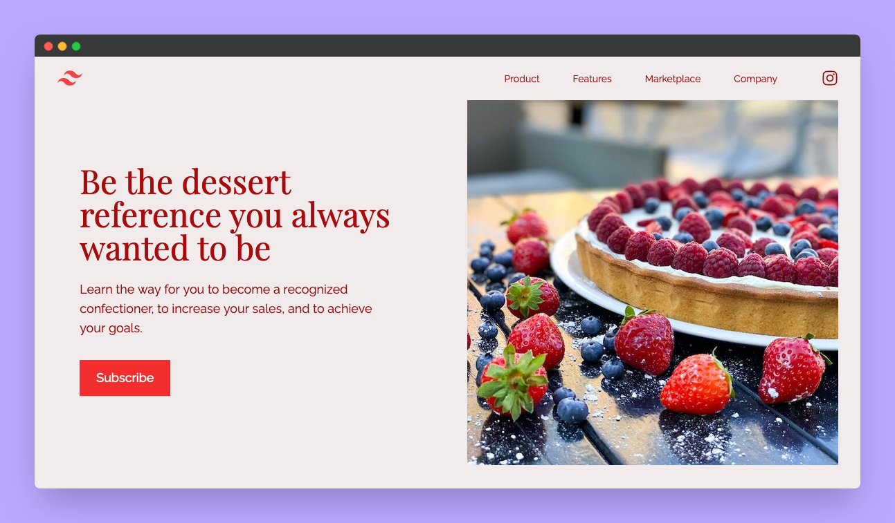

# Confectionery Course

A simple prototype, designed by myself, for a confectionery course selling page. 

## Run
Clone the repository, install the dependencies and run the app.

```bash
# Step 1. Clone the repository.

# You can use this one-line command to clone the repository:
git clone --depth=1 --filter=tree:0 --no-checkout https://github.com/koushiki-dante/kaizen.git && cd kaizen && git sparse-checkout set --no-cone confectionery-course-selling-page && git checkout && cd confectionery-course-selling-page

# Or, if you wish, you can do it step by step:
git clone --depth=1 --filter=tree:0 --no-checkout https://github.com/koushiki-dante/kaizen.git
cd kaizen
git sparse-checkout set --no-cone confectionery-course-selling-page
git checkout
cd confectionery-course-selling-page

# Step 2. Install the dependencies and run the app.
npm install
npm run dev
```
Visit http://localhost:5173 to view the app.
