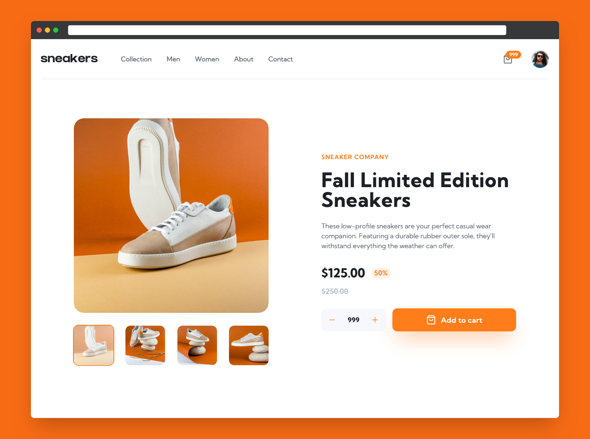

# Sneakers

A solution to a challenge from the [Frontend Mentor platform](https://www.frontendmentor.io/). The challenge is to build out [this e-commerce product page](https://www.frontendmentor.io/challenges/ecommerce-product-page-UPsZ9MJp6) and get it looking as close to the design as possible.

## Run
Clone the repository, install the dependencies and run the app.

```bash
# Step 1. Clone the repository.

# You can use this one-line command to clone the repository:
git clone --depth=1 --filter=tree:0 --no-checkout https://github.com/koushiki-dante/kaizen.git && cd kaizen && git sparse-checkout set --no-cone ecommerce-product-page && git checkout && cd ecommerce-product-page 

# Or, if you wish, you can do it step by step:
git clone --depth=1 --filter=tree:0 --no-checkout https://github.com/koushiki-dante/kaizen.git
cd kaizen
git sparse-checkout set --no-cone ecommerce-product-page 
git checkout
cd ecommerce-product-page

# Step 2. Install the dependencies and run the app.
npm install
npm run dev
```
Visit http://localhost:5173 to view the app.
